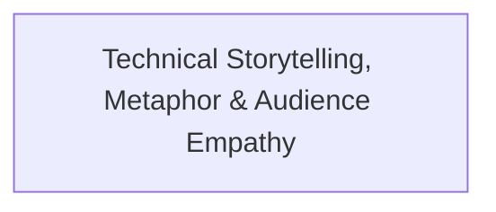

# Theme: Technical Storytelling, Metaphor & Audience Empathy

## 🗺️ Theme Mind Map

---

## 📚 Related Document Vaults

<!-- prettier-ignore-start -->
<!-- markdownlint-disable MD013 -->
| Document Title | ID  | Pillar | Status | Core Angle / Contribution to Theme |
| :------------- | :-- | :----- | :----- | :--------------------------------- |

|
[[topics/documents/series-the-engineers-guide-to-storytelling\|Series: The Engineer’s Guide to Public Storytelling & Non-Captive Audiences]]
| `TOP-073` | Communication & Storytelling | Outlined | Moving from internal team communication to
public writing requires unlearning ja... | |
[[topics/documents/the-captive-audience-trap\|The Captive Audience Trap: The Shock of Moving from Team Meetings to the Open Web]]
| `TOP-074` | Communication & Storytelling | Outlined | In corporate meetings, colleagues must
listen; on the internet, you have 2 secon... | |
[[topics/documents/the-curse-of-knowledge\|The Curse of Knowledge: Why Senior Architects Struggle to Explain Ideas Simply]]
| `TOP-075` | Communication & Storytelling | Outlined | The more you know, the harder it is to
remember what it was like not knowing; gr... | |
[[topics/documents/engineering-metaphors-that-stick\|Engineering Metaphors That Stick: Translating Abstract Tech into Tactile Concepts]]
| `TOP-076` | Communication & Storytelling | Outlined | The human brain remembers physical, tactile
metaphors 10x better than abstract s... | |
[[topics/documents/the-anatomy-of-a-non-clickbait-hook\|The Anatomy of a Non-Clickbait Hook: Earning Attention with Genuine Curiosity]]
| `TOP-077` | Communication & Storytelling | Outlined | You do not need sensationalist hype or
outrage farming to grab attention; highli... | |
[[topics/documents/learning-in-public-as-a-storyteller\|Learning in Public: Documenting the Messy Journey from Engineer to Writer]]
| `TOP-078` | Communication & Storytelling | Outlined | Readers connect with the struggle of growth
far more than the facade of effortle... | |
[[topics/documents/the-story-spine-for-software-architecture\|The Story Spine for Tech: Structuring Technical Decisions as Narrative Arcs]]
| `TOP-079` | Communication & Storytelling | Outlined | Every technical proposal should follow
classic storytelling: Status Quo -> The C... | |
[[topics/documents/meeting-readers-where-they-are\|Meeting Readers Where They Are: Writing Across Skill Levels Without Talking Down]]
| `TOP-080` | Communication & Storytelling | Outlined | High-level communication respects the
reader’s intelligence while removing unnee... |
<!-- markdownlint-restore -->
<!-- prettier-ignore-end -->

---

## 💡 Key Theme Principles

- **Systems-Level Understanding**: Ground technical and cultural topics in first principles.
- **Durable Foundations**: Focus on long-term human and architectural flourishing over transient
  hype.
