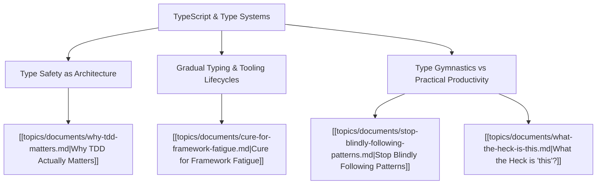

# Theme: TypeScript & Type Systems

## Metadata
- **Theme Name**: TypeScript & Type Systems
- **Category**: Software Engineering & Language Mechanics
- **Related Themes**: [[topics/themes/javascript.md|JavaScript]], [[topics/themes/coding-standards.md|Coding Standards]], [[topics/themes/testing-quality.md|Testing & Quality]]

---

## 🗺️ Theme Mind Map

---

## 📚 Related Document Vaults

| Document Title | ID | Pillar | Status | Core Angle / Contribution to Theme |
| :--- | :--- | :--- | :--- | :--- |
| [Why TDD Actually Matters](topics/documents/why-tdd-matters.md) | `TOP-007` | Pragmatic Architecture | Outlined | How static typing and automated test harnesses work together to eliminate entire classes of bugs. |
| [Stop Blindly Following Patterns](topics/documents/stop-blindly-following-patterns.md) | `TOP-012` | Pragmatic Architecture | Outlined | Avoiding excessive type gymnastics, overly abstract generics, and premature pattern optimization. |
| [Cure for Framework Fatigue](topics/documents/cure-for-framework-fatigue.md) | `TOP-005` | Pragmatic Architecture | Outlined | Relying on strong TS contracts to survive framework migrations without rewrites. |
| [What the Heck is "this"?](topics/documents/what-the-heck-is-this.md) | `TOP-002` | Pragmatic Architecture | Outlined | How TypeScript typings model `this` parameters and contextual object shapes. |

---

## 💡 Key Theme Principles
- **Types as Living Documentation**: Types should clarify intent and prevent runtime failures, not serve as puzzles for junior engineers.
- **Safety with Ergonomics**: Never sacrifice readable code for esoteric type acrobatics.
