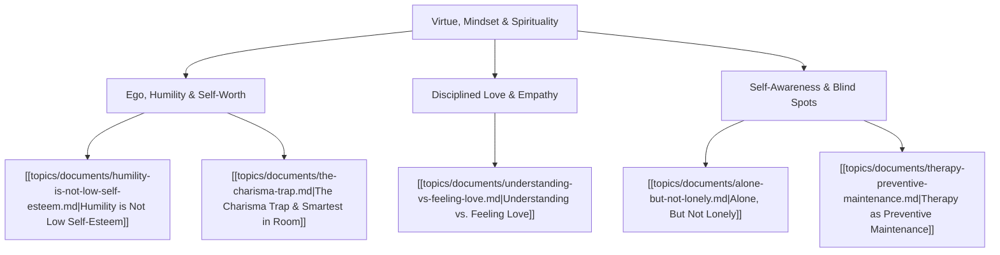

# Theme: Virtue, Mindset & Spirituality

## Metadata
- **Theme Name**: Virtue, Mindset & Spirituality
- **Category**: Philosophy, Mindset & Virtue
- **Related Themes**: [[topics/themes/relationships-solitude.md|Relationships & Solitude]], [[topics/themes/leadership-culture.md|Org Culture & Leadership]]

---

## 🗺️ Theme Mind Map

---

## 📚 Related Document Vaults

| Document Title | ID | Pillar | Status | Core Angle / Contribution to Theme |
| :--- | :--- | :--- | :--- | :--- |
| [Humility is Not Low Self-Esteem](topics/documents/humility-is-not-low-self-esteem.md) | `TOP-004` | Spirituality & Virtue | Outlined | True humility is thinking of yourself less, not thinking less of yourself. Grounded confidence without arrogance. |
| [Understanding vs. Feeling Love](topics/documents/understanding-vs-feeling-love.md) | `TOP-011` | Spirituality & Virtue | Outlined | Moving past passive emotion to active, covenantal, and sacrificial love. |
| [The Charisma Trap](topics/documents/the-charisma-trap.md) | `TOP-009` | Org Culture | Outlined | How unchecked ego and surface charm undermine collective virtue and genuine wisdom. |

---

## 💡 Key Theme Principles
- **Self-Forgetfulness is Freedom**: When you stop obsessing over your status in the room, you unlock genuine curiosity and service.
- **Virtue is an Action**: Love and humility are demonstrated in how you listen, serve, and build.
