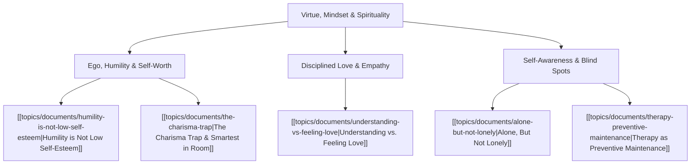

# Theme: Virtue, Mindset & Spirituality

## 🗺️ Theme Mind Map

---

## 📚 Related Document Vaults

<!-- prettier-ignore-start -->
<!-- markdownlint-disable MD013 -->
| Document Title                                                                        | ID        | Pillar                | Status   | Core Angle / Contribution to Theme                                                                                |
| :------------------------------------------------------------------------------------ | :-------- | :-------------------- | :------- | :---------------------------------------------------------------------------------------------------------------- |
| [[topics/documents/humility-is-not-low-self-esteem\|Humility is Not Low Self-Esteem]] | `TOP-004` | Spirituality & Virtue | Outlined | True humility is thinking of yourself less, not thinking less of yourself. Grounded confidence without arrogance. |
| [[topics/documents/understanding-vs-feeling-love\|Understanding vs. Feeling Love]]    | `TOP-011` | Spirituality & Virtue | Outlined | Moving past passive emotion to active, covenantal, and sacrificial love.                                          |
| [[topics/documents/the-charisma-trap\|The Charisma Trap]]                             | `TOP-009` | Org Culture           | Outlined | How unchecked ego and surface charm undermine collective virtue and genuine wisdom.                               |

|
[[topics/documents/series-neurodiversity-and-systems-thinking\|Series: Neurodiversity, ADHD & Systems Thinking in Tech]]
| `TOP-050` | Neurodiversity & Mindset | Outlined | How ADHD and INTP cognitive wiring provide
unique superpowers for complex system... | |
[[topics/documents/series-workplace-unity-and-consultation\|Series: Workplace Unity, Consultation & Blameless Culture]]
| `TOP-058` | Culture & Leadership | Outlined | Applying principle-centered consultation to
engineering teams replaces destructi... | |
[[topics/documents/servant-leadership-in-engineering\|Servant Leadership in Engineering: The Leader as Chief Roadblock Remover]]
| `TOP-062` | Culture & Leadership | Outlined | True authority in engineering is earned through
humble service, shield-bearing a... | |
[[topics/documents/learning-in-public-as-a-storyteller\|Learning in Public: Documenting the Messy Journey from Engineer to Writer]]
| `TOP-078` | Communication & Storytelling | Outlined | Readers connect with the struggle of growth
far more than the facade of effortle... | |
[[topics/documents/series-the-evolution-beyond-extractive-capitalism\|Series: The Evolution Beyond Extractive Capitalism & The Myth of Self-Interest]]
| `TOP-093` | Economics, Society & Ethics | Outlined | Short-term executive extraction, insular
optimization, and zero-marginal-cost AI... | |
[[topics/documents/the-myth-of-enlightened-self-interest\|The Myth of Enlightened Self-Interest: Why the 'Invisible Hand' Is Broken]]
| `TOP-094` | Economics, Society & Ethics | Outlined | When corporate structures insulate
decision-makers from the societal harm of the... | |
[[topics/documents/bahai-principles-and-economic-unity\|Bahá’í Principles & Economic Unity: A Blueprint for Long-Term Stewardship]]
| `TOP-099` | Economics, Society & Ethics | Outlined | Integrating spiritual principles—voluntary
profit-sharing, consultation, elimina... |
<!-- markdownlint-restore -->
<!-- prettier-ignore-end -->

---

## 💡 Key Theme Principles

- **Self-Forgetfulness is Freedom**: When you stop obsessing over your status in the room, you
  unlock genuine curiosity and service.
- **Virtue is an Action**: Love and humility are demonstrated in how you listen, serve, and build.
